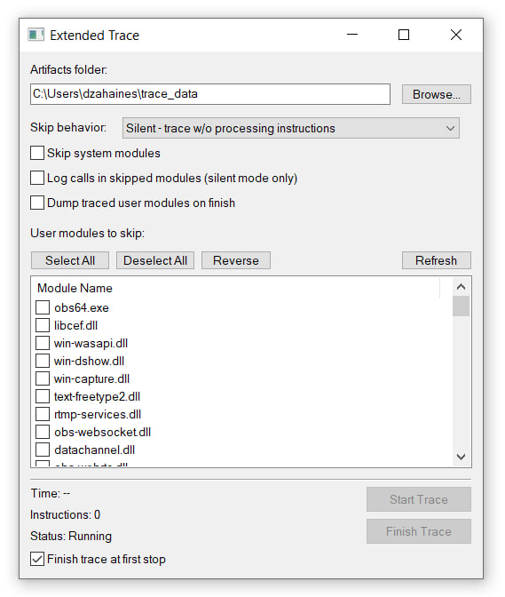

# ExtendedTrace

An x64dbg plugin for recording instruction traces to JSONL with register state, memory string resolution, and flexible module filtering.



---

## Why

x64dbg's built-in trace recorder has several issues that make it impractical for real work:

- The binary trace format is written in batches. If something interrupts recording, the output becomes unreadable - x64dbg itself can't open it.
- The format stores limited information. Memory-backed string values aren't recorded at all.
- The Log Text approach in "Trace Into" is limited in what it can output.
- There's no way to skip system or user modules during tracing. If you're tracing a full execution pipeline - say, something that reads gigabytes from disk - all those I/O syscalls end up in your trace and multiply file size and tracing time.

This plugin addresses all of the above.

## Features

- **JSONL output** - each traced instruction is written as a JSON line with full register state. If a register points to a readable memory region containing a string, that string is included in the output.
- **System module filtering** - instructions from system modules can be silently skipped or stepped over.
- **User module filtering** - individual user-space modules can be added to the skip list via the plugin window.
- **Two skip modes:**
  - *Silent* (recommended) - trace execution continues without processing instructions in skipped modules. More stable than Step Over, and still significantly faster than the built-in Trace Into.
  - *Step Over* - calls the debugger's step-over function for skipped modules. Less stable; not fully tested.
- **External call annotation** - when a call enters a module the debugger recognizes, the target function name is included in the trace log.
- **Module dumping** - modules that had instructions traced can be automatically dumped at the end of the session, using the same approach as Scylla.
- **Pause and resume** - when the built-in tracer stops, the plugin trace session stays active in a paused state. Click **Continue Tracing** to resume recording into the same file, or **Finish Trace** to end the session. This allows setting breakpoints mid-trace without splitting the output into multiple files.
- **Finish trace at first stop** - when enabled (default), the trace session ends automatically the moment the debugger stops (e.g. at a breakpoint), without requiring a manual click on **Finish Trace**. Disable this option to use the pause/resume workflow instead.
- **Settings persistence** - plugin settings and per-module filter configuration are saved and restored. Filter settings are matched to the current module list: if the loaded modules match a saved configuration, that configuration is applied automatically.
- **No trace size limit**

## When to use this instead of the built-in tracer

- Tracing code that does network I/O and behaves differently under a debugger.
- Tracing code that processes large files - system calls will dominate the trace otherwise.
- You want to orient yourself by strings the program uses, rather than by addresses.
- You prefer static analysis over runtime (record the trace, then analyze it in Binary Ninja or similar).
- The built-in "☑ Record trace" is misbehaving.

## Output format

Each line of the output file is a JSON object with a uniform structure. Calls that have a resolvable target carry an `extra` object.

**Regular instruction:**
```json
{"c":1234,"mod":"target.exe","ip":"0x7FF6A1B2C3D4","raw":"488B4108","dis":"mov rax,qword ptr ds:[rcx+8]","regs":{"rax":"0x1","rcx":{"value":"0x1A2B3C4D5E6","string":"https://example.com/api"},"rdx":"0x3"},"flags":"0x246"}
```

Fields:
- `c` - instruction counter (sequential, from 0)
- `mod` - module the instruction belongs to
- `ip` - instruction address
- `raw` - raw bytes (hex)
- `dis` - disassembly text
- `regs` - register values; zero-valued registers are omitted; if a register points to a readable ASCII or wide string (min 4 chars), the value is `{"value":"0x...","string":"..."}`
- `flags` - eflags
- `extra` - present on call instructions when the target has a resolvable name (see below)

**Call with a resolvable target:**
```json
{"c":1235,"mod":"target.exe","ip":"0x7FF6A1B2C3D5","raw":"FF15...","dis":"call qword ptr ds:[rip+0x1234]","regs":{"rcx":{"value":"0x1A2B3C4D5E6","string":"C:\\target\\file.dat"},"rdx":"0x80000000","r8":"0x3","rsp":"0x..."},"flags":"0x0","extra":{"target":"0x7FFAB1234560","target_mod":"kernel32.dll","target_type":"system","func":"kernel32.CreateFileW"}}
```

`extra` is attached to a call instruction in two cases:
- The call target belongs to a **skipped or system module** - i.e. skip system modules is enabled and the target is a system module, or the target is in the user skip list.
- The call target is in a **non-skipped module** but its name is recognized by the debugger (a symbol or export label exists at that address).

`extra` fields:
- `target` - call target address
- `target_mod` - target module name
- `target_type` - `"system"` or `"user"`
- `func` - resolved function name (`module.export` or `module.0xADDR` if no export)

Roll your own Python parser and do whatever you want with the output.

### Calls inside skipped modules

When a module is skipped, the calls it makes internally are invisible to the tracer by default. For example, `NtReadFile` may be called by `ReadFile` inside `kernel32.dll` - if `kernel32.dll` is being skipped, that internal call never reaches the trace.

To capture such calls, enable **Log calls in skipped modules** in the plugin window. It only works with **Silent** skip mode. When active, every cross-module call executed inside any skipped module is written to the trace in the standard format with an `extra` object. The `mod` field shows the skipped module the call originates from.

## Requirements

- Windows 10-11 x64 (tested on Windows 10 22H2)
- x64dbg (tested on the **August 19, 2025** snapshot)
- Visual Studio 2022 (for MSVC compiler)
- CMake 3.15 or later

## Building

### 1. Clone the repository

```
git clone https://github.com/dzahaines/Extended-Trace-x64dbg.git
cd Extended-Trace-x64dbg
```

### 2. Get the plugin SDK

The plugin SDK (`3rd_party/pluginsdk`) is not included in this repository. Copy it from your x64dbg installation:

- Navigate to your x64dbg folder
- Inside it, find the `pluginsdk` folder
- Copy it to `3rd_party/pluginsdk/`

The expected layout:

```
3rd_party/
  pluginsdk/
    _dbgfunctions.h
    _plugin_types.h
    _plugins.h
    _scriptapi.h
    ...
    x64dbg.lib
    x64bridge.lib
```

### 3. Configure with CMake

Open a **Developer Command Prompt for VS 2022** (or any shell with MSVC in PATH), then:

```
cmake -B build -A x64
```

### 4. Build

```
cmake --build build --config Release
```

The output will be at `build/Release/ExtendedTrace.dp64`.

### 5. Install

Copy `ExtendedTrace.dp64` to the `plugins` folder inside your x64dbg directory. x64dbg will load it automatically on next startup.

## Usage

1. Open a target in x64dbg.
2. Navigate to **Plugins → ExtendedTrace → Extended Trace Window** to open the plugin UI.
3. Configure:
   - Output folder for the JSONL file and module dumps.
   - Skip behavior (Step Over / Silent).
   - Whether to log calls in skipped modules (Silent mode only) - see [Calls inside skipped modules](#calls-inside-skipped-modules).
   - Whether to dump traced modules at the end.
   - Which user modules to skip.
   - **Finish trace at first stop** (enabled by default) - when checked, the trace session ends automatically as soon as the debugger stops. Uncheck to use pause/resume mode instead.
4. Make sure the debugger is paused - the target must be stopped at a breakpoint or any other paused state before starting the trace.
5. Click **Start Trace** from the plugin window or **Plugins → ExtendedTrace → Start Trace**.
6. Let the target run. The file is flushed every 1000 traced instructions, so at most 1000 entries can be lost if the process is killed or the debugger crashes mid-trace. You can adjust this value in `FlushIfNeeded` in `src/tracer.cpp`.
7. To stop the trace, the debugger must pause - hit a breakpoint, trigger an exception, or use any other mechanism that pauses execution. The trace has no built-in instruction limit and will not stop on its own.
8. When the built-in tracer stops (e.g. at a breakpoint):
   - If **Finish trace at first stop** is enabled (default): the session ends automatically and the status line shows *Finished*. No manual stop needed.
   - If disabled: the plugin session enters a **paused** state. The status line shows *Session paused*. At this point:
     - Click **Continue Tracing** to resume recording into the same output file. The instruction counter keeps incrementing from where it left off.
     - Click **Finish Trace** to end the session. The status line shows *Finished*. If module dumping is enabled, dumps are written at this point.
     - You can set or clear breakpoints, inspect memory, etc. between pauses - the output file stays open and consistent.

Settings are saved immediately when changed.

## Third-party

- [x64dbg](https://github.com/x64dbg/x64dbg) - debugger and plugin SDK
- [x64dbg PluginTemplate](https://github.com/x64dbg/PluginTemplate) - CMake project template used as a base
- [Scylla](https://github.com/NtQuery/Scylla) - PE dumping code referenced for module dump implementation